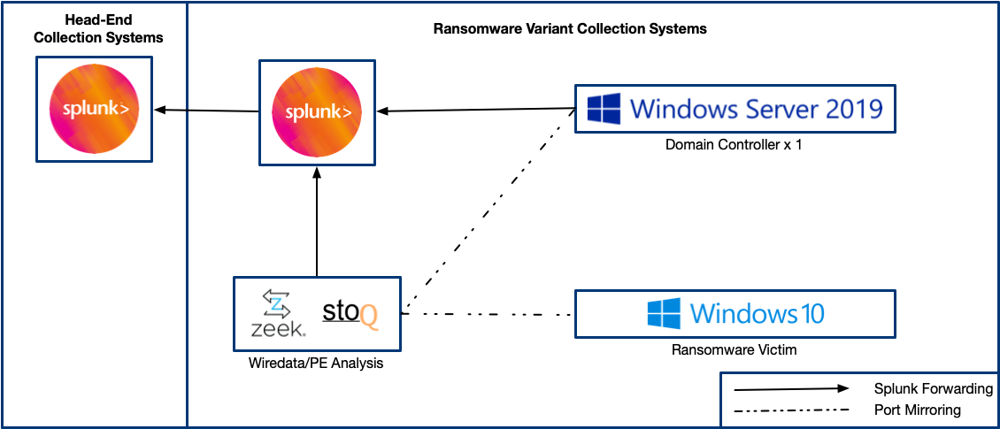

# Attack Range TuskCon (Inaugural Ransomware Derby)


## Installation 🏗

### [Ubuntu](https://github.com/davisshannon/attack_range_tuskcon/)

1. `ssh to 13.236.6.3.  Your username is the just user- and then your bingo ball number. I'll give you the password.`
2. `copy the contents of /tmp/tuskcon.keys to your local host, we'll use this in a bit.`
3. `create a .ssh directory in your home directory (mkdir .ssh).`
4. `copy /tmp/tuskcon.cer to your .ssh directory (cp /tmp/tuskcon.cer .ssh/.).`
5. `modify permissions on tuskcon.cer to make it usable (chmod 600 .ssh/tuskcon.cer).`
6. `git clone https://raw.githubusercontent.com/davisshannon/attack_range_tuskcon/main/scripts/ubuntu_deploy.sh`
7. `bash ubuntu_deploy.sh`
8. `https://www.google.com/search?q=what+is+my+ip`
9. `cd into attack_range_tuskcon`
10. `edit attack_range.conf`
- `range_name- Add your bingo ball number to the end of tuskcon-.`
11. `edit users.yml`
- `change name to be user- and then your bingo ball number.`
- `change email to be your email address.`
- `change ip to be the IP address from number 8.  Make sure to keep the /32 on the end.`
- `change key to be your public key if you want to SSH to the Splunk and Zeek boxes.`
12. `run aws configure to configure your aws client. The key and private key are what you copied in step 2.  Just use ap-southeast-2 for your region and leave the output format blank.`
13. `run source venv/bin/activate to enter the virtual environment.`
14. `run python attack_range.py build to build the range.`

## Architecture 🏯


The virtualized deployment of Attack Range consists of:

- Windows Domain Controller
- Windows Workstation
- Splunk Server
- Zeek Sensor

#### Logging
The following log sources are collected from the machines:
- Everything should be in index=main.

### Build Attack Range
```
python attack_range.py build
```

### Show Attack Range Infrastructure
```
python attack_range.py show
```

### Perform Attack Simulation
```
python attack_range.py simulate -st T1003.001 -t ar-win-dc-default-username-33048
```

### Test with Attack Range
```
python attack_range.py test -tf tests/T1003_001.yml
```

### Destroy Attack Range
```
python attack_range.py destroy
```

### Stop Attack Range
```
python attack_range.py stop
```

### Resume Attack Range
```
python attack_range.py resume
```
